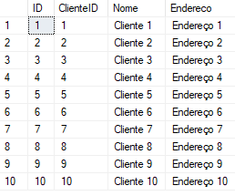
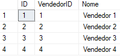
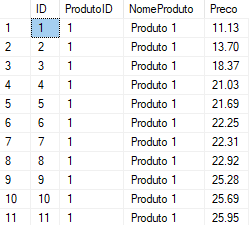
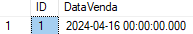
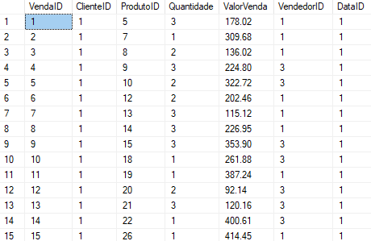

# DW - Vendas

## Criando e utilizando o banco de dados da atividade

```sql
CREATE DATABASE atividadeSAD;
USE atividadeSAD;
```

## Criando tabela de VENDAS

```sql
CREATE TABLE Vendas (
    VendaID INT IDENTITY(1,1) PRIMARY KEY,
    DataVenda DATETIME,
    ValorVenda DECIMAL(10, 2),
    ClienteID INT,
    NomeCliente NVARCHAR(100),
    EnderecoCliente NVARCHAR(255),
    ProdutoID INT,
    NomeProduto NVARCHAR(100),
    PrecoUnitario DECIMAL(10, 2),
    Quantidade INT,
    VendedorID INT,
    NomeVendedor NVARCHAR(100)
);
```

## Inserindo dados

```sql
DECLARE @i INT = 0;

WHILE @i < 200
BEGIN
    INSERT INTO Vendas (
        DataVenda,
        ValorVenda,
        ClienteID,
        NomeCliente,
        EnderecoCliente,
        ProdutoID,
        NomeProduto,
        PrecoUnitario,
        Quantidade,
        VendedorID,
        NomeVendedor
    )
    VALUES (
        GETDATE(),
        ROUND((RAND() * (500 - 50) + 50), 2),
        @i % 10 + 1,
        'Cliente ' + CAST((@i % 10 + 1) AS NVARCHAR(10)),
        'Endereço ' + CAST((@i % 10 + 1) AS NVARCHAR(10)),
        @i % 5 + 1,
        'Produto ' + CAST((@i % 5 + 1) AS NVARCHAR(10)),
        ROUND((RAND() * (100 - 10) + 10), 2),
        @i % 3 + 1,
        @i % 4 + 1,
        'Vendedor ' + CAST((@i % 4 + 1) AS NVARCHAR(10))
    );

    SET @i = @i + 1;
END
```

## Consultando

```sql
SELECT * FROM Vendas;
```

## Criando dimensão dos CLIENTES e inserindo dados

```sql
CREATE TABLE D_Clientes(
 ID INT IDENTITY(1,1) PRIMARY KEY,
 ClienteID INT,
 Nome VARCHAR(150),
 Endereco NVARCHAR(255)
);

INSERT INTO D_Clientes (ClienteID, Nome, Endereco)
SELECT DISTINCT
	ClienteID,
    NomeCliente,
    EnderecoCliente
FROM Vendas;
```

## Consultando dimensão dos Clientes

```sql
SELECT * FROM D_Clientes;
```

## Resultado



## Criando dimensão dos VENDEDORES e inserindo dados

```sql
CREATE TABLE D_Vendedores(
 ID INT IDENTITY(1,1) PRIMARY KEY,
 VendedorID INT,
 Nome VARCHAR(150),
);

INSERT INTO D_Vendedores (VendedorID, Nome)
SELECT DISTINCT
	VendedorID,
    NomeVendedor
FROM Vendas;
```

## Consultando dimensão dos Vendedores

```sql
SELECT * FROM D_Vendedores;
```

## Resultado



## Criando dimensão dos PRODUTOS e inserindo dados

```sql
CREATE TABLE D_Produtos(
 ID INT IDENTITY(1,1) PRIMARY KEY,
 ProdutoID INT,
 NomeProduto VARCHAR(150),
 Preco DECIMAL(10, 2)
);

INSERT INTO D_Produtos (ProdutoID, NomeProduto, Preco)
SELECT DISTINCT
	ProdutoID,
    NomeProduto,
	PrecoUnitario
FROM Vendas;
```

## Consultando dimensão dos Produtos

```sql
SELECT * FROM D_Produtos;
```

## Resultado



## Criando dimensão dos DATAS e inserindo dados

```sql
CREATE TABLE D_Datas(
 ID INT IDENTITY(1,1) PRIMARY KEY,
 DataVenda DATETIME
);

INSERT INTO D_Datas (DataVenda)
SELECT DISTINCT
	CONVERT(DATE, DataVenda)
FROM Vendas;
```

## Consultando dimensão dos Datas

```sql
SELECT * FROM D_Datas;
```

## Resultado



## Criando fato das VENDAS e inserindo dados

```sql
CREATE TABLE F_Vendas (
    VendaID INT IDENTITY(1,1) PRIMARY KEY,
    ClienteID INT FOREIGN KEY REFERENCES D_Clientes(ID),
    ProdutoID INT FOREIGN KEY REFERENCES D_Produtos(ID),
    Quantidade INT,
    ValorVenda DECIMAL(10, 2),
    VendedorID INT FOREIGN KEY REFERENCES D_Vendedores(ID),
    DataID INT FOREIGN KEY REFERENCES D_Datas(ID)
);

INSERT INTO F_Vendas (ClienteID, ProdutoID, Quantidade, ValorVenda, VendedorID, DataID)
SELECT DISTINCT
    cliente.ID AS ClienteID,
    produto.ID AS ProdutoID,
    v.Quantidade,
    v.ValorVenda,
    vendedor.ID AS VendedorID,
	data.ID as DataID
FROM
    Vendas v
    INNER JOIN D_Clientes cliente ON v.NomeCliente = cliente.Nome
    INNER JOIN D_Produtos produto ON v.NomeProduto = produto.NomeProduto AND v.PrecoUnitario = produto.Preco
    INNER JOIN D_Vendedores vendedor ON v.NomeVendedor = vendedor.Nome
    INNER JOIN D_Datas data ON CONVERT(DATE, v.DataVenda) = data.DataVenda;
```

## Consultando dimensão dos Datas

```sql
SELECT * FROM F_Vendas;
```

## Resultado


